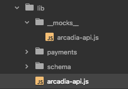
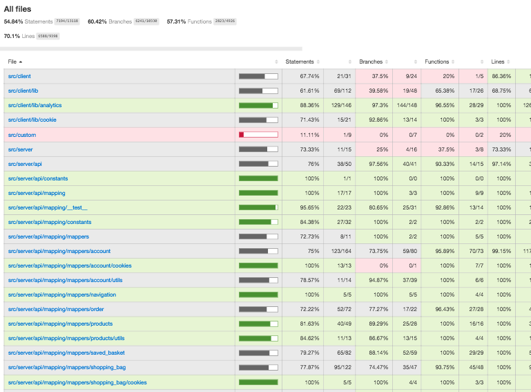
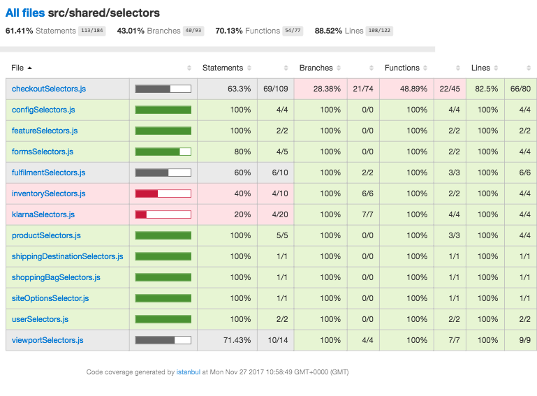
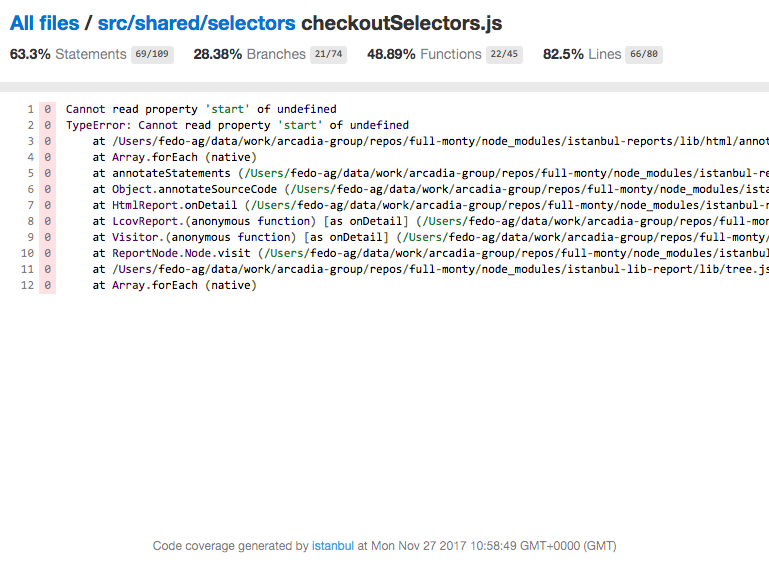
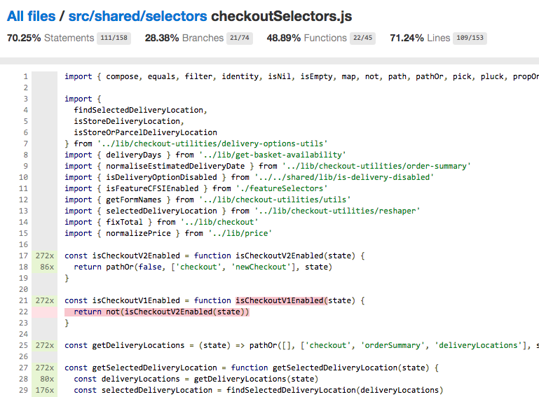

# Unit Testing Monty
> In association with [Enzyme]() + [Jest](http://facebook.github.io/jest/) + __Good practices__.

## Test Coverage Checklist
- Output / Side-effects
  - [x] Cover all output & side-effects for conditions / branched logic
  - [x] Explicitly highlight all states for the unit of code
- Dependencies
  - [x] Stub / mock all dependencies - do not depend on their output or side-effects
  - [x] Cover any inputs (args/props) passed (especially non serializable - point 5)
  - [x] Cover the output / side-effects of any functions passed
- Check the [code coverage reports](#code-coverage-reports) and make sure that
  - [x] the files you worked on have good code coverage
  - [x] your code can be [properly analysed](#coverage-report-error) by the [jest built-in coverage tool](#code-coverage-reports)

## Snapshot Declarations
- I promise to...
  - [x] Review new and updated snapshots during development and in PRs
    - __Seriously!__ Check the snapshot outputs what I'm expecting
  - [x] Run `jest:watch` while developing
    - So I get prompted to update snapshots for components I've changed, and other cool things
    - And work a bit more TDD
  - [x] Where possible, reduce snapshots by only selecting what is being tested
    - `expect(getTreeFor(component.find('Something'))).toMatchSnapshot()`
    - `expect(component.find('Many').map(getTreeFor)).toMatchSnapshot()`
    - `expect(object.property).toMatchSnapshot()`

## Component Test Guide
> test = (props) + (Component) -> assert (render, lifecycle, events, calls)

- Tests the component in all possible states based on props, primarily asserting:
  1. Component Rendered output _(ideally only snapshot)_
    - for render output dependant on internal state, assert at the level the state update is triggered (options below)
  2. Component lifecycle _(if any)_
  3. DOM events _(if any)_
  4. Calls to dependencies _(if any)_
    - generally functions passed in props to children
    - any expected needs the component has are present
- Use [test-component helper](../test/unit/helper/test-component) to reduce boilerplate and keep tests DRY
  - Vu Nam: But dude, this only does shallow rendering, what about `ref's` et al?
  - Helper: _(Assuming you trust React)_ You test them directly and mock the side-effects
    - `component.find('Something').node.ref(mockElement)` _Tada!_
    - ... or don't use the helper and use mount rendering (if you really have to!)
  - You: _(crickets)_
  - Helper: Come at me bro!

### Example Spec
```js
// import test dependencies
import testComponentHelper from '../../helpers/test-component'
// ...

// mock component dependencies - optional
jest.mock('../dep-a', () => ({
  A: jest.fn(),
  X: jest.fn()
}))
import { A, X } from '../dep-a'

// import component
import Component from 'path/to/Component'

describe('<Component />', () => {
  // set up reused mocks/stubs, test fixtures, helpers - if any
  const mockFoo = jest.fn(() => ...)
  const maybeInitialProps = {...}
  const renderComponent = testComponentHelper(Component, maybeRenderOptions)

  // 1. tests for all component & prop initial render possibilities
  describe('@renders', () => {
    // mostly snapshot tests
    it('in X state')
    it('with X prop')
  })

  // 2. test lifecycle methods - if any
  describe('@lifecycle', () => {
    describe('on componentWillMount', () => {
      it('calls A')
    })

    describe('on componentDidUpdate', () => {
      it('calls X when .../in ... state')
      it('updates state when .../in ... state')
    })
  })

  // 3. test DOM event handlers - if any
  describe('@events', () => {
    it('<button key="foo" /> calls C on click')
    it('<select key="bar" /> calls H on change')

    describe('<input key="baz" />', () => {
      it('calls X on focus')
      it('does not call X on focus when .../in ... state')
      it('updates state on mouseup')
    })
  })

  // 4a. test child component function props and refs - if any
  describe('@children', () => {
    describe('<select key="a" />', () => {
      it('sets X instance prop via ref')
    })

    describe('<Button key="b" />', () => {
      it('calls A on clickHandler prop')
    })
  })

  // 4b. test components needs are present and as expected
  describe('@needs', () => {
    it('contains a call to X')
    it('contains a call to A with argument Y')
  })

  // 4x. Identify and add other common cases and document below
})
```

## Action Creator Test Guide
> test = (args) + (Action Creator) > assert (actions, calls)

- Tests the action dispatched from an action creator, primarily asserting:
  1. Dispatched actions
  2. calls to dependencies _(if any)_
- Only test action creators with any kind of logic (conditions, calls to dependancies, ...)
  - No value in testing really simple creators

## Reducer Test Guide
> test = (action, state) + (Reducer) -> assert (state)

- Tests the state outputted by a reducer for an action, primarily asserting:
  1. Outputted state

## _Feature Test Guide - WIP_
> test = (state, route, actions) + (Route, Dispatch, Store) -> assert (render, state, server, side-effects)

- Tests the integration of a feature within the application, only mocking externals to the application i.e browser I/O & server API, primarily asserting:
  1. Application Rendered output _(snapshot)_
  2. Application state _(snapshot)_
  3. Outbound only API requests _(if any)_
    - i.e order, payments, analytics, ...
  4. External side-effects _(if any)_
    - Browser I/O - i.e localstorage
    - Third-party API - i.e Klarna
    - ...

> This is what will eventually really help "invert the pyramid"!

## Migration path
### Tasks
- Use jest-codemods to do the initial heavy lifting & fix any issues / areas not modified correctly
- Replace use of `rewire` with `jest.mock`
- Replace use of `sinon.mock|spy` with `jest.fn` (optional)
  - but can't stub object.method with `jest.fn` i.e. `sinon.stub(foo, 'getBar') --> foo.getBar = jest.fn()`
- Refactor component tests to be inline with the [Component Test Guide](#component-test-guide)

### Once all tests are migrated
- Clean up unrequited tasks, script or dependencies

### Responsibilities
- Each developer
  - refactors / adds tests related to what they're working on
  - refactors N existing tests per X time period
- Team or a select few
  - Group the application into features (possibly using e2e features as a guide)
  - Write the specs for each feature
  - Create mocks / stubs for server, browser and external services
  - Implement the specs

## Guides

### Manual module mocking (https://facebook.github.io/jest/docs/manual-mocks.html)

Let's take as an example `src/server/handlers/product-handler.js`. Let's say that we want to test the `productsSearchHandler` function and in particular the following logic:

```js
  // src/server/handlers/product-handler.js

  import aracadiaApi from './lib/arcadia-api'
  ...
  export function productsSearchHandler(req, reply) {
    ...
    return aracadiaApi(url, req)
      .then(({ body }) => {
        reply(getResponseData(body)).code(200)
      })
      .catch(reply)
}

```

It's clear that we have a dependency from `arcadiaApi` that we need to mock out since in our unit tests we don't want to depend from external services.

Jest provides a way to mock manually an entire module.
First of all create a folder named `__mocks__` at the same level of the file of the module to mock, and create in it a file with the same name of the module you want to mock, in this case:



In the mocked module you have to rewrite all the module's functions in order to overwrite the original ones and you have to create a function that will permit you to set up the mocked data that the mocked function will return for a particular scenario:

```js
  // src/server/handlers/lib/__mocks__/arcadia-api.js

  let mockResponse = Promise.resolve({ body: 'Default mocked body' })

  export function __setMockResponse(url, req, responsePromise) {
    mockResponse = {}

    // mockResponse = {
    //   'product/seo': {
    //     'req': new Promise(...)
    //   }
    // }
    mockResponse[url] = {}
    mockResponse[url][req] = responsePromise
  }

  export default function requestToArcadiaApi(path, req) {
    return mockResponse[path] && mockResponse[path][req] ? mockResponse[path][req] : mockResponse
  }
```

Now you are ready to mock out the library in your tests. What follows is an example of a scenario where we use the mock of the `arcadia-api` module.

```js
  ...

  jest.mock('./../lib/arcadia-api')
  import * as arcadiaApi from './../lib/arcadia-api'

  ...

  it('calls arcadiaApi and then replies as expected', async () => {
    ...
    arcadiaApi.__setMockResponse('product/seo', 'req', Promise.resolve({ body: 'body response' }))
    ...
    await productHandlerModule.productsSearchHandler(mockedReqArgument, mockedReplyFunction)
      .then(() => {
        ...
      })
  })
```

Particularly interesting is the line:

```js
  arcadiaApi.__setMockResponse('product/seo', 'req', Promise.resolve({ body: 'body response' }))
```

where we set the response that we want to obtain from the mocked arcadia-api module once we call the function under test.

```js
  // src/server/handlers/product-handler.js

  export function productsSearchHandler(req, reply) {
    ...
    return aracadiaApi(url, req)
      .then(({ body }) => {
        reply(getResponseData(body)).code(200)
      })
      .catch(reply)
  }
```

In particular once we in our test we call `productsSearchHandler` what will happen is that the callback of the first `then` will be called with the value `body response` in consequence of the argument `{ body: 'body response' }` that we used to call `arcadiaApi.__setMockResponse`.


### How to test async function (e.g.: Promises)

Let's take as an example the module `src/server/handlers/__test__/product-handler.spec.js` and its function `productsSearchHandler` where we want to test the following logic:

```js
  // src/server/handlers/__test__/product-handler.spec.js

  ...
  export function productsSearchHandler(req, reply) {  
    ...
    return aracadiaApi(url, req)
      .then(({ body }) => {
        reply(getResponseData(body)).code(200)
      })
      .catch(reply)
  }
  ...
```

A naive approach (the first one that I implemented) could make you think that you can test it like this:

```js
  it('calls "reply" function in case of Promise resolution', () => {
    productsSearchHandler(...)
      .then((...) => {
        expect(replyMock).toHaveBeenCalledTimes(1)
      })
  })
```

The approach just showed works if you have just one scenario or when you have more and you don't need to use mocks or you use mocks but you don't need to reset them before to run the next scenario.

Given that we need in most the cases to test multiple scenarios and that we use common mocks we need another approach and this is represented by the usage of `async/await`.

```js
  // src/server/handlers/__test__/product-handler.spec.js

  beforeEach(() => {
    ...
    jest.resetAllMocks()
  })

  ...

  it('calls arcadiaApi and then replies as expected', async () => {
    ...

    await productHandlerModule.productsSearchHandler(...)
      .then(() => {
        expect(mockedReplyFunction).toHaveBeenCalledTimes(1)
      })
      ...
    })
```

Doing so you make sure that the different scenarios are run in series and hence you can be sure about the mock reset between the scenarios.

### [Code Coverage Reports](#code-coverage-reports)

The coverage reports can be generated running the command `npm run jest:coverage`.

This command will create
- LCOV coverage report file (`coverage/lcov.info`) that can be imported in different IDEs/editors
- LCOV HTML report (`coverage/lcov-report/index.html`)




**[Note](#coverage-report-error)**: even if the test+coverage command succeed, single files can still fail to export the complete report. When the report of a specific file looks like



it means that the jest coverage can't properly analyse the tested files.
That doesn't necessarily mean that the code is syntactically wrong, but in general following the [Airbnb JavaScript Style Guide](https://github.com/airbnb/javascript) allows you to avoid this issue. 

For example, one of the most common errors are related to functions declaration/hoisting and can be fixed just using named function expressions instead of function declarations https://github.com/airbnb/javascript#functions--declarations


